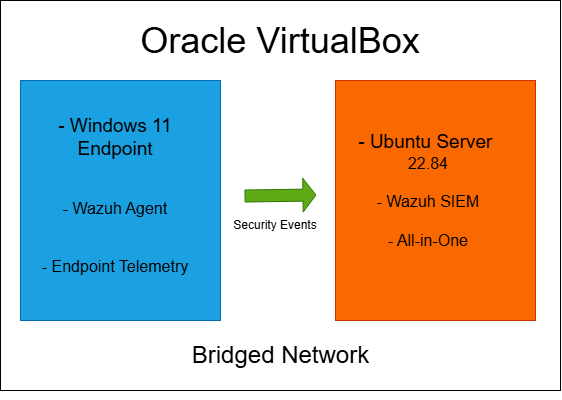
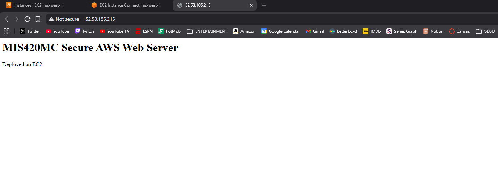
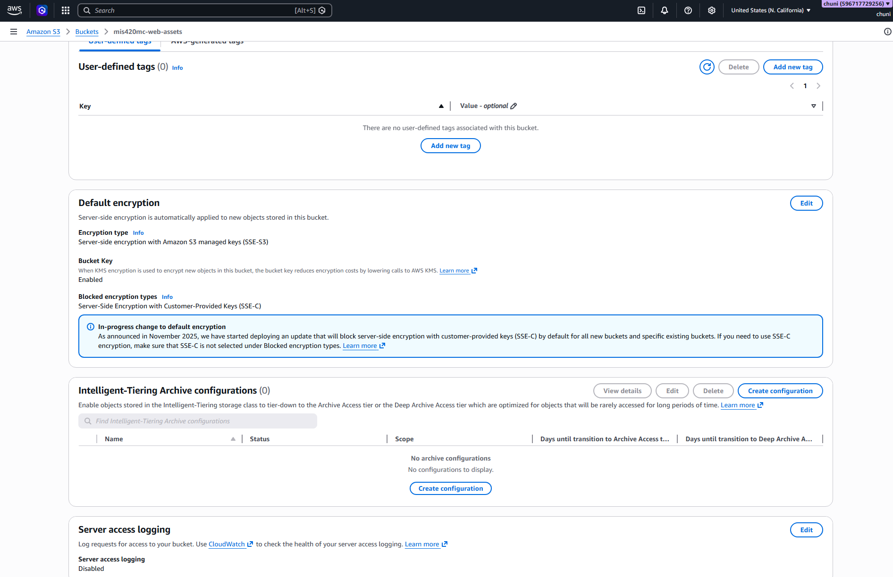
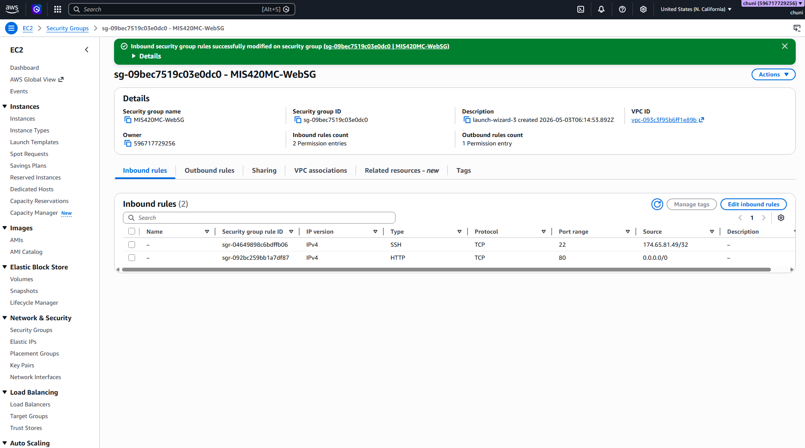
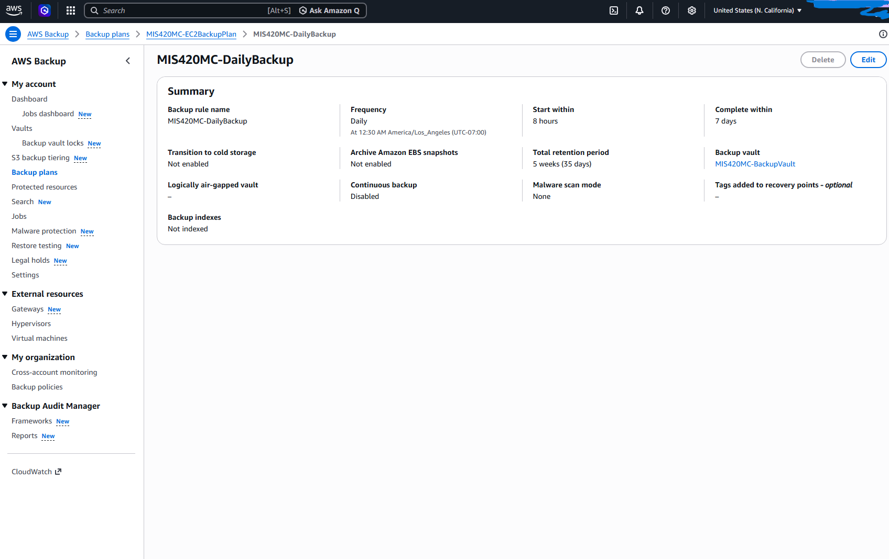
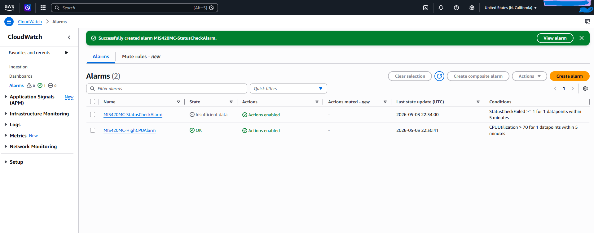
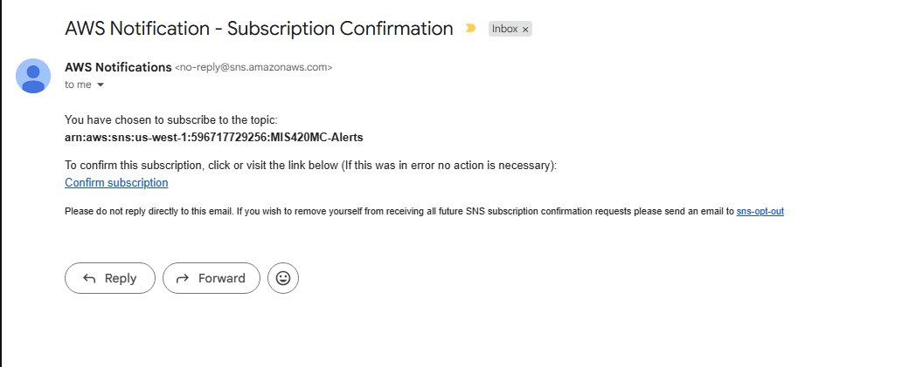
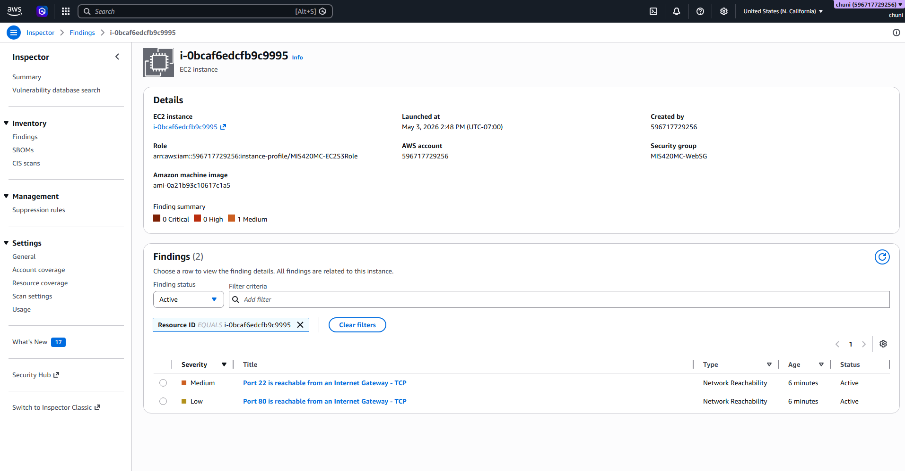

# Secure AWS Web Server Environment

Hands-on AWS cloud security lab focused on deploying, securing, monitoring, and protecting a public-facing EC2 web server.

## Overview

This project documents the design and deployment of a web server environment in Amazon Web Services. I deployed an Apache web server on Amazon EC2 and integrated multiple AWS services to improve access control, data protection, monitoring, vulnerability management, and recovery.

The environment uses AWS IAM for identity and permissions, Amazon S3 for storage, AWS Backup and AMIs for recovery, Amazon CloudWatch and SNS for monitoring and alerting, and Amazon Inspector for vulnerability assessment.

The goal of the project was to gain hands-on experience building cloud infrastructure while applying practical AWS security controls around a public-facing workload.

## Architecture

The environment consists of a public-facing EC2 web server supported by several AWS security and operational services.

### Environment Components

**Compute**
- Amazon EC2
- Amazon Linux
- Apache HTTP Server

**Storage**
- Amazon S3
- Server-side encryption
- Public access blocked

**Identity & Access**
- AWS IAM users
- IAM roles
- Administrative and read-only access levels

**Monitoring & Alerting**
- Amazon CloudWatch
- Amazon SNS
- CPU utilization alarm
- EC2 status check alarm

**Security**
- EC2 security groups
- Restricted SSH access
- Amazon Inspector

**Backup & Recovery**
- AWS Backup
- EC2 AMI

---

## What I Did

### 1. Deployed an EC2 Web Server

I launched an Amazon Linux EC2 instance and configured it with a public IP address so the server could be accessed through a web browser.

After the instance was running, I connected to it and installed Apache. I then created a basic webpage to confirm that the server was successfully serving web content.

The EC2 instance became the central workload for the project and was later integrated with IAM, CloudWatch, AWS Backup, SNS, and Amazon Inspector.

### 2. Configured Network Security

I configured an EC2 security group to control the traffic allowed to reach the server.

The server required HTTP access on port 80 so the website could remain publicly accessible.

SSH access on port 22 was restricted to a single trusted IP address using `/32` notation instead of allowing SSH connections from anywhere on the internet.

This reduced the attack surface of the administrative interface while still allowing the web server to remain publicly accessible.

### 3. Configured S3 Storage

I created two Amazon S3 buckets for storage-related purposes.

Security controls included:

- Server-side encryption
- Public access blocking
- IAM-controlled access
- Separate buckets for different storage purposes

Encrypting the buckets protects stored data at rest, while blocking public access reduces the risk of accidental exposure.

### 4. Configured IAM Users and Roles

I configured IAM identities with different permission levels to demonstrate access separation.

The environment included:

- Administrative IAM user
- Read-only IAM user
- IAM role for the EC2 instance
- IAM role for AWS Backup

Instead of storing AWS credentials directly on the EC2 instance, I attached an IAM role to the server.

This allows the EC2 instance to interact with AWS services without requiring hard-coded long-term access keys on the system.

### 5. Configured Backup and Recovery

I configured AWS Backup to protect the EC2 workload and created a backup plan for the instance.

I also created an Amazon Machine Image (AMI), providing another recovery option if the original EC2 instance became unavailable or needed to be rebuilt.

This provided multiple recovery options instead of relying entirely on the running EC2 instance.

### 6. Configured CloudWatch Monitoring

I used Amazon CloudWatch to monitor the health and performance of the EC2 instance.

Two CloudWatch alarms were configured:

- CPU utilization above 70%
- EC2 instance status check failure

These alarms provide visibility into abnormal resource usage and infrastructure health problems.

### 7. Configured SNS Notifications

I connected the CloudWatch alarms to an Amazon SNS topic.

The SNS topic was configured to send email notifications when an alarm condition was triggered.

This allowed the environment to generate automated alerts without requiring the CloudWatch dashboard to be monitored manually.

### 8. Performed Vulnerability Assessment

I enabled Amazon Inspector to evaluate the EC2 instance for potential security issues and network exposure.

Inspector identified that ports 22 and 80 were reachable.

Port 80 was intentionally exposed because it was required for the web server. SSH access on port 22 presented more risk, so I restricted SSH access to my trusted IP address through the EC2 security group.

This demonstrated a basic vulnerability management workflow:

1. Identify an exposure
2. Determine whether it is required
3. Evaluate the associated risk
4. Modify the environment to reduce unnecessary exposure

---

## Security Controls Implemented

| Area | Security Control |
| --- | --- |
| Identity | Separate IAM permission levels |
| EC2 Access | IAM role attached to EC2 |
| Network Security | EC2 security groups |
| SSH | Restricted to a trusted `/32` IP |
| Web Traffic | HTTP access on port 80 |
| Storage | S3 server-side encryption |
| S3 Exposure | Public access blocked |
| Monitoring | CloudWatch metrics and alarms |
| Notifications | SNS email alerts |
| Vulnerability Management | Amazon Inspector |
| Backup | AWS Backup |
| Recovery | EC2 Amazon Machine Image |

---

## Security Analysis

One of the main things I learned from this project was how heavily AWS security depends on configuration.

The EC2 instance intentionally needed to be publicly reachable for the website to function, but that did not mean every service on the instance needed the same level of exposure.

HTTP traffic on port 80 was required for the website, while SSH on port 22 was only required for administration. Restricting SSH access to a trusted IP reduced unnecessary exposure while preserving administrative access.

IAM was another important part of the environment. Creating users with different permission levels demonstrated how access can be separated based on responsibility. Attaching an IAM role directly to EC2 also avoided the need to store long-term AWS credentials directly on the server.

Amazon Inspector showed that a finding does not automatically mean a service should be disabled. Security findings need context. Port 80 was intentionally exposed because it supported the application, while port 22 required stronger restrictions because it provided administrative access.

The project used several layers of security rather than relying on one control:

- IAM controls who can perform actions
- Security groups control network access
- S3 encryption protects stored data
- Amazon Inspector identifies vulnerabilities and exposure
- CloudWatch monitors system health
- SNS provides automated notifications
- AWS Backup and AMIs provide recovery options

---

## Operational Support Plan

If this environment were running long-term, maintaining it would require more than deploying the infrastructure once.

### Daily / Automated

- Monitor CloudWatch alarms
- Review SNS notifications
- Monitor EC2 instance health
- Check for failed backup jobs
- Investigate important security alerts

### Weekly

- Review Amazon Inspector findings
- Review unusual EC2 activity
- Confirm backups are completing successfully
- Check system resource usage
- Review security group changes
- Investigate repeated authentication failures

### Monthly

- Apply operating system security updates
- Update Apache and installed packages
- Review IAM users and permissions
- Remove unnecessary access
- Review EC2 security group rules
- Confirm S3 public access settings
- Review backup retention settings

### Periodically

- Test recovery from a backup or AMI
- Audit IAM permissions for least privilege
- Review the environment for unnecessary internet exposure
- Review AWS costs and unused resources
- Test the incident response process
- Review security architecture as the environment changes

In a larger production environment, these responsibilities would normally be divided between cloud administrators, security engineers, and incident response personnel.

---

## Incident Response Plan

If suspicious activity or a compromise were detected in this environment, I would use the following response process.

### 1. Detection

A potential incident could be identified through:

- CloudWatch alarms
- SNS notifications
- Amazon Inspector findings
- Unexpected resource utilization
- EC2 status check failures
- Suspicious authentication activity
- Unexpected network exposure

### 2. Triage

The first step would be determining the scope and severity of the incident.

Questions I would investigate include:

- Which AWS resource is affected?
- When did the activity begin?
- Which IAM users or roles were involved?
- Is the activity still occurring?
- Are additional AWS resources affected?
- Was sensitive data accessed or modified?

### 3. Containment

Depending on the incident, containment could include:

- Modifying EC2 security group rules
- Removing unnecessary inbound access
- Restricting access to the affected instance
- Disabling compromised IAM credentials
- Removing unnecessary IAM permissions
- Creating a snapshot or AMI before making major changes

The goal would be to stop further unauthorized activity while preserving enough information to investigate what happened.

### 4. Investigation

I would review available AWS and system information to determine the cause and impact of the incident.

This could include:

- CloudWatch data
- Amazon Inspector findings
- IAM configuration
- Security group rules
- EC2 configuration
- Operating system logs
- Web server logs
- Available AWS activity logs

The investigation would focus on identifying the initial entry point and determining whether additional resources were affected.

### 5. Eradication

Once the cause was identified, remediation could include:

- Applying security patches
- Removing unauthorized files or software
- Closing unnecessary ports
- Updating security group rules
- Rotating compromised credentials
- Removing excessive IAM permissions
- Correcting insecure AWS configurations

If the EC2 server were heavily compromised, rebuilding it from a known-good image could be safer than trying to clean the existing instance.

### 6. Recovery

The service could then be restored using:

- AWS Backup recovery points
- A known-good EC2 AMI
- A newly created EC2 instance

Before returning the system to normal operation, I would verify:

- The web server functions normally
- Security group rules are correct
- IAM permissions are correct
- Monitoring is active
- Backups are functioning
- Significant security findings have been addressed

### 7. Post-Incident Review

After recovery, I would document:

- What happened
- How the incident was detected
- Which resources were affected
- What actions were taken
- Which controls worked
- Which controls failed or were missing
- What changes could prevent the incident from happening again

The findings would then be used to improve monitoring, security controls, architecture, and response procedures.

---

## Screenshots

### EC2 Web Server

Amazon EC2 instance running an Apache web server and serving a webpage through its public IP address.

### S3 Encryption

Amazon S3 bucket configuration showing server-side encryption enabled.

### IAM Access Control

IAM users configured with different permission levels for administrative and read-only access.

### EC2 IAM Role

IAM role attached to the EC2 instance, allowing the workload to interact with AWS services without storing long-term credentials on the server.

### Restricted SSH Access

EC2 security group configuration restricting SSH access to a trusted source.

### AWS Backup

AWS Backup plan configured to protect the EC2 workload.

### CloudWatch Monitoring

CloudWatch alarms configured to monitor CPU utilization and EC2 instance health.

### SNS Notifications

Amazon SNS email subscription used to receive automated CloudWatch notifications.

### Amazon Inspector

Amazon Inspector findings used to evaluate network exposure on the EC2 instance.

---

## Skills & Tools

- Amazon Web Services (AWS)
- Amazon EC2
- Amazon S3
- AWS Identity and Access Management (IAM)
- Amazon CloudWatch
- Amazon SNS
- Amazon Inspector
- AWS Backup
- Amazon Machine Images (AMI)
- Linux
- Apache HTTP Server
- Cloud Security
- IAM & Access Control
- Security Groups
- Vulnerability Assessment
- Cloud Monitoring
- Backup & Recovery
- Incident Response Planning

---

## What I'd Improve Next

The current lab demonstrates several core AWS security controls, but there are additional improvements I would make if I continued developing the environment.

### Identity & Access

- Enable MFA for privileged IAM accounts
- Replace broad AWS-managed permissions with more specific least-privilege policies
- Reduce reliance on long-term IAM user credentials
- Regularly review unused IAM permissions

### Network Security

- Reduce direct administrative exposure to the internet
- Replace public SSH administration with AWS Systems Manager Session Manager
- Separate public-facing and internal resources using VPC subnets
- Review network access using more restrictive security group rules

### Web Security

- Enable HTTPS instead of relying on HTTP
- Configure TLS certificates using AWS Certificate Manager
- Place an Application Load Balancer in front of the web server
- Deploy AWS WAF to help protect against common web attacks

### Logging & Detection

- Enable AWS CloudTrail for AWS API activity logging
- Add AWS Config for configuration monitoring
- Evaluate Amazon GuardDuty for threat detection
- Centralize security logs in a dedicated S3 bucket
- Create additional security-focused CloudWatch alarms

### Vulnerability Management

- Perform regular Amazon Inspector reviews
- Track findings through remediation
- Prioritize vulnerabilities based on severity and exposure
- Establish a defined patch management schedule

### Backup & Recovery

- Perform regular recovery tests
- Define a Recovery Time Objective (RTO)
- Define a Recovery Point Objective (RPO)
- Document a repeatable recovery procedure
- Verify backups instead of only confirming that backup jobs completed

---

## Key Takeaways

This project gave me hands-on experience deploying and securing an AWS workload using several services together rather than treating each service independently.

The biggest takeaway was that cloud security is largely about managing relationships between identity, network access, monitoring, vulnerability management, and recovery.

Deploying the EC2 server was only one part of the project. Securing access to it, monitoring its health, evaluating its exposure, and creating recovery options were equally important parts of building the environment.
